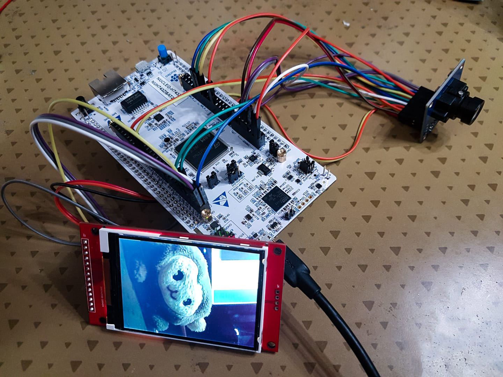
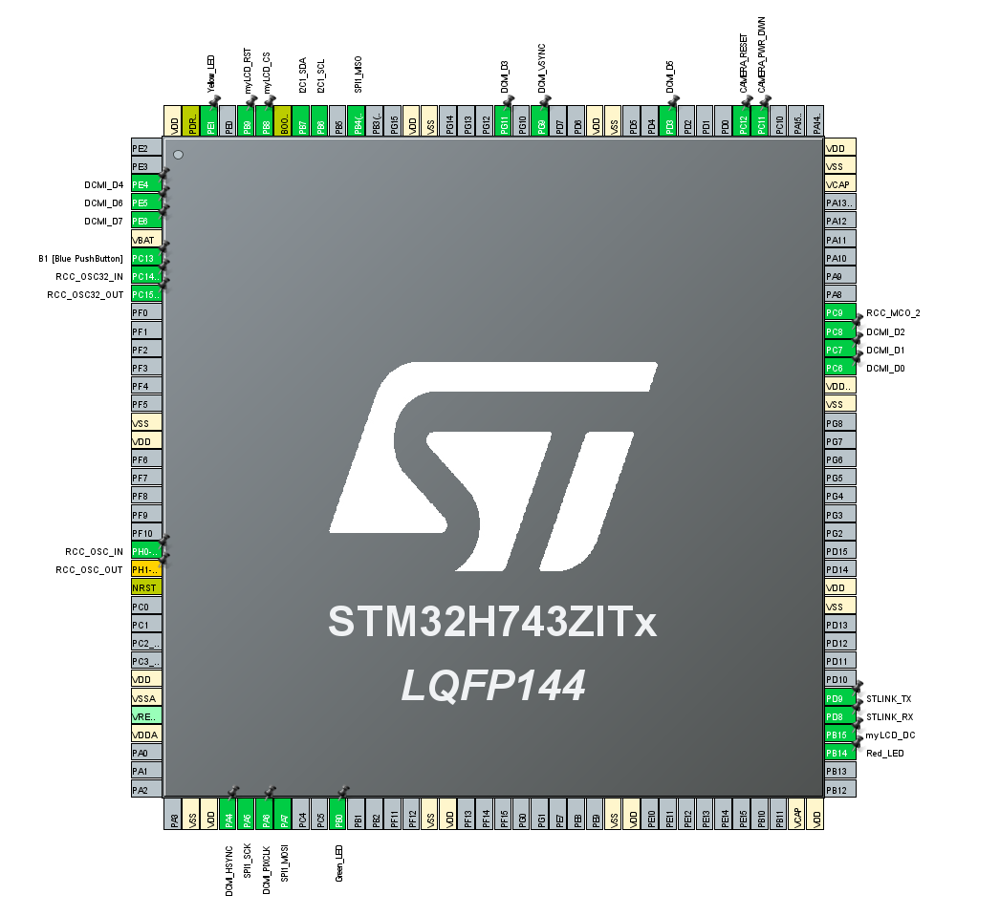
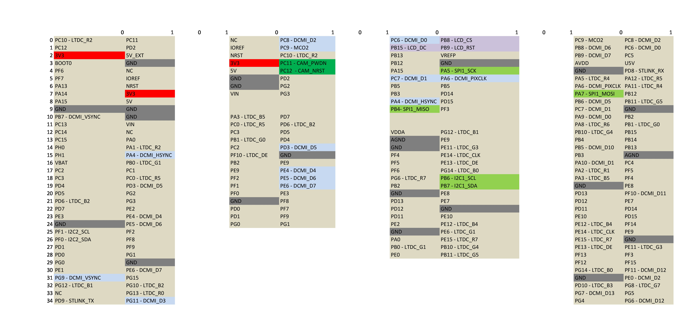

# STM32-H7-camera-interface-and-display
 STM32-H7 Nucleo board interface with OV7670 camera and ILI9341(Serial)

 # Description
 This repo provides the library and demo code to interface a OV7670 camera via the DCMI interface found in several STM32 microcontrollers. To test and debug, a serial(SPI) interface for the ILI9341 is also provided, which displays the image captured.
 
 As you can see, this is only a small(and messy) demo, but it will be useful for future projects.  

 It should be fairly easy to port it to different STM32 boards, provided they have a DCMI interface.

 # Usage
You can see the API for both the OV7670 and the ILI9341 in `OV7670.h` and `ILI9341.h`, respectively.

## OV7670.h
    You must define `CAMERA_RESET_GPIO_Port` and `CAMERA_RESET_Pin` for the library to work properly(probably in `main.h`). Also, you should think about adding an output pin for the powerdown pin on the OV7670 module. This library builds from the STM32 HAL, so you must include it.

    In `OV7670_REG.h` you can find the register configuration for the OV7670; Feel free to play with those values or changing them altogether if you are using a different camera module. I didn't find much documentation about this(apart from the datasheet), so I strongly advise checking similar projects(see credits section)

## ILI9341.h
    You must define the 'CS', `DC` and `RST` pin and ports. To do so, you can change the values in `ILI9341.h`. This library builds from the STM32 HAL, so you must include it.

    In  `ILI9341_GFX.h` you can find the API for useful functions like drawing images or different shapes on screen.

# Pinout
Pinout of CubeMX:

Pinout of Nucleo-H743ZI2 board:

# Comments and caveats
- This code is subject to improvement, so feel free to contribute.
- Check the credits section for more information, as this is heavily based on other projects.
- You can also check Application note AN5020 from ST for detailed info about the DCMI interface.
- If you are interested in greatly improving the camera interface, check application note AN4861 from ST.
- `img.h` is just an image in RGB565 mode used for testing
- You can use the python functions in `RGB565_Research.ipynb` and `$ xxd -i` to create your own test images.

# Future steps
- Add grayscale support(YUV mode, get one out of two bytes).
- Clean up code and general improvements.
- Adapt library for lightweight applications.
- Generalize support for more OV cameras.

# Credits
This project is heavily based on [DigitalCamera_STM32](https://github.com/iwatake2222/DigitalCamera_STM32) by iwatake2222, and [STM32-ILI9341](https://github.com/martnak/STM32-ILI9341) by martnak. Check them out!

